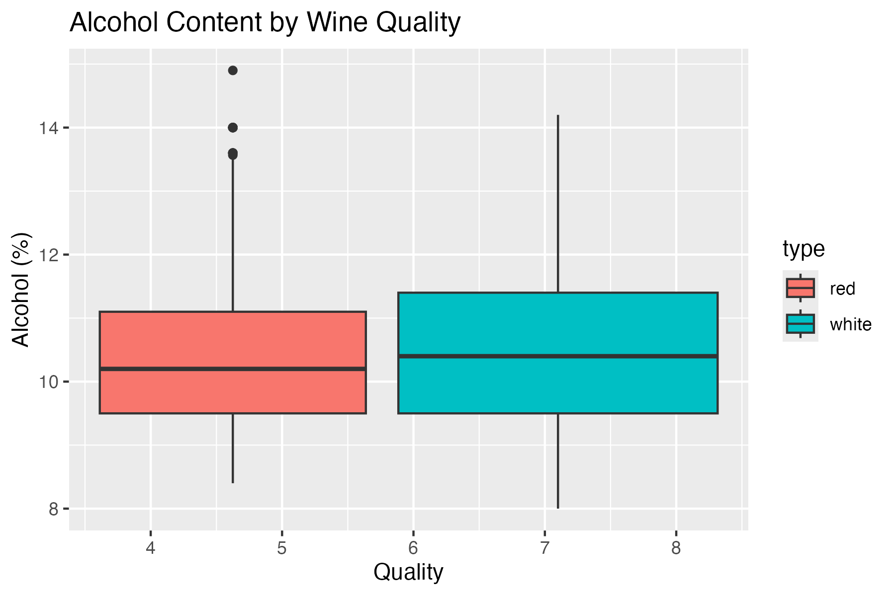
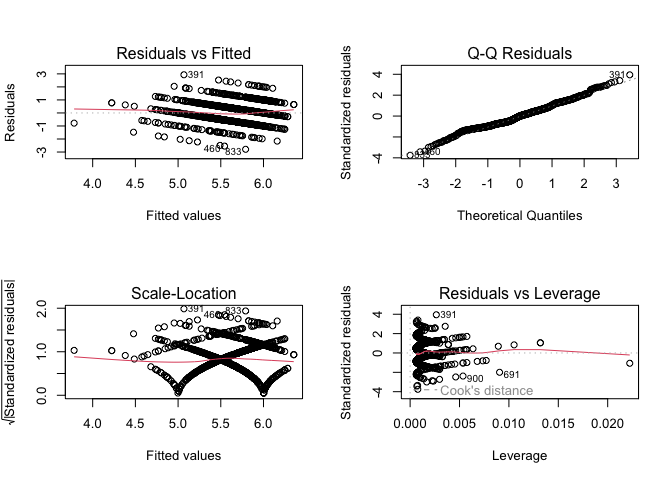
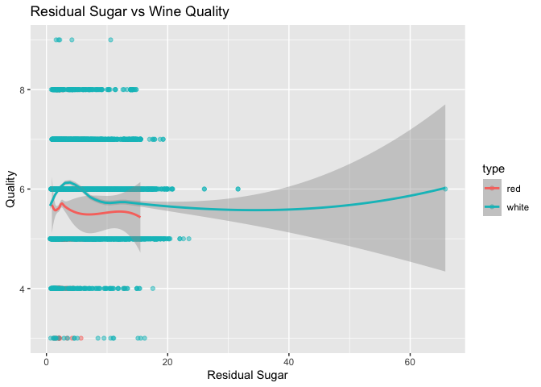

README
================

# Exploratory-Data-Analysis-with-R

## Business Understandings

Goal: a wine producer has hired me to better understand what non-obvious
factors affect wine quality

After some background research I have found that: - Wine quality depends
on chemical properties (like acidity, sugar, pH, alcohol content) as
well as human taste. - Higher alcohol is typically associated with
better quality wines. - Too much residual sugar or acidity can
negatively impact taste. - Balance among components is important as
extreme values might hurt quality.

Therefore, I will explore how each chemical property relates to wine
quality.

## Data Understandings

I will firstly load and inspect the datasets to get a better
understanding of them.

``` r
# Load libraries
library(tidyverse)
```

    ## ── Attaching core tidyverse packages ──────────────────────── tidyverse 2.0.0 ──
    ## ✔ dplyr     1.1.4     ✔ readr     2.1.5
    ## ✔ forcats   1.0.0     ✔ stringr   1.5.1
    ## ✔ ggplot2   3.5.1     ✔ tibble    3.2.1
    ## ✔ lubridate 1.9.4     ✔ tidyr     1.3.1
    ## ✔ purrr     1.0.4     
    ## ── Conflicts ────────────────────────────────────────── tidyverse_conflicts() ──
    ## ✖ dplyr::filter() masks stats::filter()
    ## ✖ dplyr::lag()    masks stats::lag()
    ## ℹ Use the conflicted package (<http://conflicted.r-lib.org/>) to force all conflicts to become errors

``` r
library(knitr) # for nice tables later

# Read the data
red_wine <- read.csv("/Users/nickmckenzie/Downloads/wine+quality/winequality-red.csv", sep = ";")
white_wine <- read.csv("/Users/nickmckenzie/Downloads/wine+quality/winequality-white.csv", sep = ";")

# Quick look
glimpse(red_wine)
```

    ## Rows: 1,599
    ## Columns: 12
    ## $ fixed.acidity        <dbl> 7.4, 7.8, 7.8, 11.2, 7.4, 7.4, 7.9, 7.3, 7.8, 7.5…
    ## $ volatile.acidity     <dbl> 0.700, 0.880, 0.760, 0.280, 0.700, 0.660, 0.600, …
    ## $ citric.acid          <dbl> 0.00, 0.00, 0.04, 0.56, 0.00, 0.00, 0.06, 0.00, 0…
    ## $ residual.sugar       <dbl> 1.9, 2.6, 2.3, 1.9, 1.9, 1.8, 1.6, 1.2, 2.0, 6.1,…
    ## $ chlorides            <dbl> 0.076, 0.098, 0.092, 0.075, 0.076, 0.075, 0.069, …
    ## $ free.sulfur.dioxide  <dbl> 11, 25, 15, 17, 11, 13, 15, 15, 9, 17, 15, 17, 16…
    ## $ total.sulfur.dioxide <dbl> 34, 67, 54, 60, 34, 40, 59, 21, 18, 102, 65, 102,…
    ## $ density              <dbl> 0.9978, 0.9968, 0.9970, 0.9980, 0.9978, 0.9978, 0…
    ## $ pH                   <dbl> 3.51, 3.20, 3.26, 3.16, 3.51, 3.51, 3.30, 3.39, 3…
    ## $ sulphates            <dbl> 0.56, 0.68, 0.65, 0.58, 0.56, 0.56, 0.46, 0.47, 0…
    ## $ alcohol              <dbl> 9.4, 9.8, 9.8, 9.8, 9.4, 9.4, 9.4, 10.0, 9.5, 10.…
    ## $ quality              <int> 5, 5, 5, 6, 5, 5, 5, 7, 7, 5, 5, 5, 5, 5, 5, 5, 7…

``` r
glimpse(white_wine)
```

    ## Rows: 4,898
    ## Columns: 12
    ## $ fixed.acidity        <dbl> 7.0, 6.3, 8.1, 7.2, 7.2, 8.1, 6.2, 7.0, 6.3, 8.1,…
    ## $ volatile.acidity     <dbl> 0.27, 0.30, 0.28, 0.23, 0.23, 0.28, 0.32, 0.27, 0…
    ## $ citric.acid          <dbl> 0.36, 0.34, 0.40, 0.32, 0.32, 0.40, 0.16, 0.36, 0…
    ## $ residual.sugar       <dbl> 20.70, 1.60, 6.90, 8.50, 8.50, 6.90, 7.00, 20.70,…
    ## $ chlorides            <dbl> 0.045, 0.049, 0.050, 0.058, 0.058, 0.050, 0.045, …
    ## $ free.sulfur.dioxide  <dbl> 45, 14, 30, 47, 47, 30, 30, 45, 14, 28, 11, 17, 1…
    ## $ total.sulfur.dioxide <dbl> 170, 132, 97, 186, 186, 97, 136, 170, 132, 129, 6…
    ## $ density              <dbl> 1.0010, 0.9940, 0.9951, 0.9956, 0.9956, 0.9951, 0…
    ## $ pH                   <dbl> 3.00, 3.30, 3.26, 3.19, 3.19, 3.26, 3.18, 3.00, 3…
    ## $ sulphates            <dbl> 0.45, 0.49, 0.44, 0.40, 0.40, 0.44, 0.47, 0.45, 0…
    ## $ alcohol              <dbl> 8.8, 9.5, 10.1, 9.9, 9.9, 10.1, 9.6, 8.8, 9.5, 11…
    ## $ quality              <int> 6, 6, 6, 6, 6, 6, 6, 6, 6, 6, 5, 5, 5, 7, 5, 7, 6…

``` r
# Dimensions
cat("Red Wine: ", dim(red_wine)[1], "rows,", dim(red_wine)[2], "columns\n")
```

    ## Red Wine:  1599 rows, 12 columns

``` r
cat("White Wine: ", dim(white_wine)[1], "rows,", dim(white_wine)[2], "columns\n")
```

    ## White Wine:  4898 rows, 12 columns

``` r
# ----- NEW: Data Preparation -----

# Add a 'type' column to each dataset
red_wine$type <- "red"
white_wine$type <- "white"

# Combine into one dataset
wine_data <- bind_rows(red_wine, white_wine)

# Quick check of combined data
glimpse(wine_data)
```

    ## Rows: 6,497
    ## Columns: 13
    ## $ fixed.acidity        <dbl> 7.4, 7.8, 7.8, 11.2, 7.4, 7.4, 7.9, 7.3, 7.8, 7.5…
    ## $ volatile.acidity     <dbl> 0.700, 0.880, 0.760, 0.280, 0.700, 0.660, 0.600, …
    ## $ citric.acid          <dbl> 0.00, 0.00, 0.04, 0.56, 0.00, 0.00, 0.06, 0.00, 0…
    ## $ residual.sugar       <dbl> 1.9, 2.6, 2.3, 1.9, 1.9, 1.8, 1.6, 1.2, 2.0, 6.1,…
    ## $ chlorides            <dbl> 0.076, 0.098, 0.092, 0.075, 0.076, 0.075, 0.069, …
    ## $ free.sulfur.dioxide  <dbl> 11, 25, 15, 17, 11, 13, 15, 15, 9, 17, 15, 17, 16…
    ## $ total.sulfur.dioxide <dbl> 34, 67, 54, 60, 34, 40, 59, 21, 18, 102, 65, 102,…
    ## $ density              <dbl> 0.9978, 0.9968, 0.9970, 0.9980, 0.9978, 0.9978, 0…
    ## $ pH                   <dbl> 3.51, 3.20, 3.26, 3.16, 3.51, 3.51, 3.30, 3.39, 3…
    ## $ sulphates            <dbl> 0.56, 0.68, 0.65, 0.58, 0.56, 0.56, 0.46, 0.47, 0…
    ## $ alcohol              <dbl> 9.4, 9.8, 9.8, 9.8, 9.4, 9.4, 9.4, 10.0, 9.5, 10.…
    ## $ quality              <int> 5, 5, 5, 6, 5, 5, 5, 7, 7, 5, 5, 5, 5, 5, 5, 5, 7…
    ## $ type                 <chr> "red", "red", "red", "red", "red", "red", "red", …

``` r
# ----- NEW: Create Feature Table -----

# Feature names
features <- colnames(wine_data)

# Define feature types manually
feature_types <- c(
  "Ratio",   # fixed acidity
  "Ratio",   # volatile acidity
  "Ratio",   # citric acid
  "Ratio",   # residual sugar
  "Ratio",   # chlorides
  "Ratio",   # free sulfur dioxide
  "Ratio",   # total sulfur dioxide
  "Ratio",   # density
  "Ratio",   # pH
  "Ratio",   # sulphates
  "Ratio",   # alcohol
  "Ordinal", # quality
  "Nominal"  # type
)

# Create a table showing feature names and types
feature_table <- data.frame(
  Feature = features,
  Data_Type = feature_types
)

# Print the feature table
kable(feature_table, caption = "Feature Names and Their Data Types (Wine Quality Dataset)", format = "markdown")
```

| Feature              | Data_Type |
|:---------------------|:----------|
| fixed.acidity        | Ratio     |
| volatile.acidity     | Ratio     |
| citric.acid          | Ratio     |
| residual.sugar       | Ratio     |
| chlorides            | Ratio     |
| free.sulfur.dioxide  | Ratio     |
| total.sulfur.dioxide | Ratio     |
| density              | Ratio     |
| pH                   | Ratio     |
| sulphates            | Ratio     |
| alcohol              | Ratio     |
| quality              | Ordinal   |
| type                 | Nominal   |

Feature Names and Their Data Types (Wine Quality Dataset)

From the datasets we can find a lot of information. We can see the
datatypes of the features and I have listed the key findings below:

##### Dataset info:

Red Wine: 1599 samples, 12 features White Wine: 4898 samples, 12
features Target Variable: quality (scored from 0-10)

## Data Preparation

First we will check for any missing values.

``` r
# Check for missing values
    colSums(is.na(red_wine))
```

    ##        fixed.acidity     volatile.acidity          citric.acid 
    ##                    0                    0                    0 
    ##       residual.sugar            chlorides  free.sulfur.dioxide 
    ##                    0                    0                    0 
    ## total.sulfur.dioxide              density                   pH 
    ##                    0                    0                    0 
    ##            sulphates              alcohol              quality 
    ##                    0                    0                    0 
    ##                 type 
    ##                    0

``` r
    colSums(is.na(white_wine))
```

    ##        fixed.acidity     volatile.acidity          citric.acid 
    ##                    0                    0                    0 
    ##       residual.sugar            chlorides  free.sulfur.dioxide 
    ##                    0                    0                    0 
    ## total.sulfur.dioxide              density                   pH 
    ##                    0                    0                    0 
    ##            sulphates              alcohol              quality 
    ##                    0                    0                    0 
    ##                 type 
    ##                    0

As there are no missing values, we can move on to better preparing the
data. I will add a “type” column to combine red and white wine into one
dataset.

``` r
# Add a 'type' column
red_wine$type <- "red"
white_wine$type <- "white"
# Combine
wine_data <- bind_rows(red_wine, white_wine)
# Check
glimpse(wine_data)
```

    ## Rows: 6,497
    ## Columns: 13
    ## $ fixed.acidity        <dbl> 7.4, 7.8, 7.8, 11.2, 7.4, 7.4, 7.9, 7.3, 7.8, 7.5…
    ## $ volatile.acidity     <dbl> 0.700, 0.880, 0.760, 0.280, 0.700, 0.660, 0.600, …
    ## $ citric.acid          <dbl> 0.00, 0.00, 0.04, 0.56, 0.00, 0.00, 0.06, 0.00, 0…
    ## $ residual.sugar       <dbl> 1.9, 2.6, 2.3, 1.9, 1.9, 1.8, 1.6, 1.2, 2.0, 6.1,…
    ## $ chlorides            <dbl> 0.076, 0.098, 0.092, 0.075, 0.076, 0.075, 0.069, …
    ## $ free.sulfur.dioxide  <dbl> 11, 25, 15, 17, 11, 13, 15, 15, 9, 17, 15, 17, 16…
    ## $ total.sulfur.dioxide <dbl> 34, 67, 54, 60, 34, 40, 59, 21, 18, 102, 65, 102,…
    ## $ density              <dbl> 0.9978, 0.9968, 0.9970, 0.9980, 0.9978, 0.9978, 0…
    ## $ pH                   <dbl> 3.51, 3.20, 3.26, 3.16, 3.51, 3.51, 3.30, 3.39, 3…
    ## $ sulphates            <dbl> 0.56, 0.68, 0.65, 0.58, 0.56, 0.56, 0.46, 0.47, 0…
    ## $ alcohol              <dbl> 9.4, 9.8, 9.8, 9.8, 9.4, 9.4, 9.4, 10.0, 9.5, 10.…
    ## $ quality              <int> 5, 5, 5, 6, 5, 5, 5, 7, 7, 5, 5, 5, 5, 5, 5, 5, 7…
    ## $ type                 <chr> "red", "red", "red", "red", "red", "red", "red", …

Now we have a full dataset with both wine types labeled.

## Modeling & Evaluating

I will now perform an Exploratory Data Analysis (EDA). First I will
check general distributions and explore some key variables.

``` r
# Generate and save the quality plot
wine_data %>%
  ggplot(aes(x = factor(quality), fill = type)) +
  geom_bar(position = "dodge") +
  labs(title = "Wine Quality Distribution", x = "Quality Score", y = "Count")
```

<!-- -->

``` r
ggsave("images/quality_plot.png", width = 6, height = 4)

# Generate and save the alcohol plot
wine_data %>%
  ggplot(aes(x = quality, y = alcohol, fill = type)) +
  geom_boxplot() +
  labs(title = "Alcohol Content by Wine Quality", x = "Quality", y = "Alcohol (%)")
```

<!-- -->

``` r
ggsave("images/alcohol_plot.png", width = 6, height = 4)
```

``` r
## Quality Distribution
#

## Alcohol vs Quality  
#
```

From the Wine Quality Distribution we see that the distribution follows
a near-normal curve peaking at quality score 6 (most common rating).
White wines (blue bars) are more prevalent than reds at all quality
levels and very few wines score at extremes (almost none at 3 or 9).

In the Alcohol Content by Wine Quality visualization we see a clear
positive correlation: higher alcohol content associates with better
quality. White wines generally have lower alcohol content than reds at
the same quality level and outliers appear more frequently in lower
quality wines.

From these visualizations and our background understandings we can
generate some hypotheses to test: \##### Hypothesis 1: Higher alcohol
content leads to better wine quality \##### Hypothesis 2: Lower volatile
acidity leads to better wine quality (especially for red wine) \#####
Hypothesis 3: Wines with moderate residual sugar have better quality
(nonlinear relationship)

Now I will get into some statistical testing to test these hypotheses.
We will first test Hypothesis 1: Higher alcohol content leads to better
wine quality. We can do this by checking the correlation first and then
performing a linear regression:

``` r
cor(wine_data$alcohol, wine_data$quality)
```

    ## [1] 0.4443185

``` r
lm1 <- lm(quality ~ alcohol, data = wine_data)
summary(lm1)
```

    ## 
    ## Call:
    ## lm(formula = quality ~ alcohol, data = wine_data)
    ## 
    ## Residuals:
    ##     Min      1Q  Median      3Q     Max 
    ## -3.5042 -0.4957 -0.0488  0.5043  3.2115 
    ## 
    ## Coefficients:
    ##             Estimate Std. Error t value Pr(>|t|)    
    ## (Intercept) 2.405269   0.085941   27.99   <2e-16 ***
    ## alcohol     0.325312   0.008139   39.97   <2e-16 ***
    ## ---
    ## Signif. codes:  0 '***' 0.001 '**' 0.01 '*' 0.05 '.' 0.1 ' ' 1
    ## 
    ## Residual standard error: 0.7824 on 6495 degrees of freedom
    ## Multiple R-squared:  0.1974, Adjusted R-squared:  0.1973 
    ## F-statistic:  1598 on 1 and 6495 DF,  p-value: < 2.2e-16

As we can see from the generated statistics, the statistical tests fail
to reject this hypothesis. The correlation coefficient (0.444) shows a
moderate positive relationship between alcohol and quality. From the
regression results we can see that Highly significant p-value (\<2e-16)
confirms alcohol is a meaningful predictor. The coefficient (0.325)
means each 1% increase in alcohol corresponds to ~0.33 point increase in
quality score. However, the R-squared (0.197) indicates alcohol alone
explains only about 20% of quality variation, suggesting other factors
are important.

Next we will test Hypothesis 2: Lower volatile acidity leads to better
wine quality (especially for red wine). We will also check the
correlations and then run a linear regression:

``` r
# Filter red wine
red_only <- wine_data %>% filter(type == "red")

# Correlation
cor(red_only$volatile.acidity, red_only$quality)
```

    ## [1] -0.3905578

``` r
# Linear regression
lm2 <- lm(quality ~ volatile.acidity, data = red_only)
summary(lm2)
```

    ## 
    ## Call:
    ## lm(formula = quality ~ volatile.acidity, data = red_only)
    ## 
    ## Residuals:
    ##      Min       1Q   Median       3Q      Max 
    ## -2.79071 -0.54411 -0.00687  0.47350  2.93148 
    ## 
    ## Coefficients:
    ##                  Estimate Std. Error t value Pr(>|t|)    
    ## (Intercept)       6.56575    0.05791  113.39   <2e-16 ***
    ## volatile.acidity -1.76144    0.10389  -16.95   <2e-16 ***
    ## ---
    ## Signif. codes:  0 '***' 0.001 '**' 0.01 '*' 0.05 '.' 0.1 ' ' 1
    ## 
    ## Residual standard error: 0.7437 on 1597 degrees of freedom
    ## Multiple R-squared:  0.1525, Adjusted R-squared:  0.152 
    ## F-statistic: 287.4 on 1 and 1597 DF,  p-value: < 2.2e-16

From the correlation results we find that their is a Strong negative
correlation (-0.391). This also fails to reject this Hypothesis that
lower volatile acidity associates with better quality in red wines. The
relationship is statistically significant (p \< 2.2e-16) and
directionally meaningful. When looking at the regression, the
coefficient the intercept is 6.566, which is the expected quality score
when volatile acidity is zero. The slope is -1.761, meaning each 1 g/L
increase in volatile acidity corresponds to a ~1.76 point decrease in
quality score. The R-squared of 0.152 means volatile acidity explains
about 15% of quality variation in red wines. While significant, this
suggests other factors play larger roles in determining quality. This
analysis strongly supports Hypothesis 2, revealing volatile acidity as a
key negative quality predictor in red wines. The effect is both
statistically and practically significant, though other factors clearly
contribute to quality perceptions.

Finally, we can look into Hypothesis 3: Wines with moderate residual
sugar have better quality (nonlinear relationship). We should first
create a visualization to get a better understanding of the data.

``` r
wine_data %>%
  ggplot(aes(x = residual.sugar, y = quality, color = type)) +
  geom_point(alpha = 0.5) +
  geom_smooth(method = "loess") +
  labs(title = "Residual Sugar vs Wine Quality", x = "Residual Sugar", y = "Quality")
```

    ## `geom_smooth()` using formula = 'y ~ x'

<!-- -->

From this visualization we see the curves for both red and white wines
appear to show a nonlinear relationship between residual sugar and
quality. Quality seems to peak at moderate residual sugar levels (likely
between ~5–20 g/L, though exact values depend on the data) and declines
at very low or very high sugar levels. This supports Hypothesis 3. Now
we can categorize sugar into bins to check differences to check if there
is a significant difference in sugar levels in regards to quality. We
can do this by splitting them into “low”, “medium”, “high” sugar levels
and test.

``` r
wine_data <- wine_data %>%
  mutate(sugar_level = case_when(
    residual.sugar < 5 ~ "low",
    residual.sugar < 15 ~ "medium",
    TRUE ~ "high"
  ))

# Boxplot
wine_data %>%
  ggplot(aes(x = sugar_level, y = quality, fill = type)) +
  geom_boxplot() +
  labs(title = "Sugar Levels vs Quality", x = "Sugar Level", y = "Quality")
```

<!-- -->

``` r
# ANOVA
anova_sugar <- aov(quality ~ sugar_level, data = wine_data)
summary(anova_sugar)
```

    ##               Df Sum Sq Mean Sq F value   Pr(>F)    
    ## sugar_level    2     25  12.650   16.67 6.02e-08 ***
    ## Residuals   6494   4928   0.759                     
    ## ---
    ## Signif. codes:  0 '***' 0.001 '**' 0.01 '*' 0.05 '.' 0.1 ' ' 1

    #              Df Sum Sq Mean Sq F value   Pr(>F)    
    #sugar_level    2     25  12.650   16.67 6.02e-08 ***
    #Residuals   6494   4928   0.759                     
    #---
    #Signif. codes:  0 ‘***’ 0.001 ‘**’ 0.01 ‘*’ 0.05 ‘.’ 0.1 ‘ ’ 1 

The significant p-value (6.02e-08) confirms that at least one sugar
level group (low/medium/high) has a statistically different mean
quality. The small sum of squares (Sum Sq = 25 vs. Residuals = 4928)
suggests sugar level explains a modest portion of quality variation.
Other factors (e.g., alcohol, acidity) likely play larger roles.
Ultimately we also fail to reject this hypothesis.

## Conclusion

Through exploratory data analysis of the UCI Wine Quality Dataset, I
found that alcohol content and volatile acidity are significant
predictors of wine quality, with alcohol showing a positive relationship
and volatile acidity a negative one (especially in red wines).
Additionally, residual sugar appears to have a nonlinear relationship
with wine quality, with moderate levels associated with higher scores.
These insights can help wine producers optimize chemical balances to
enhance product quality. While these factors are important, wine quality
is subjective and influenced by additional elements such as sensory
perception and production methods that are not captured in this dataset.
